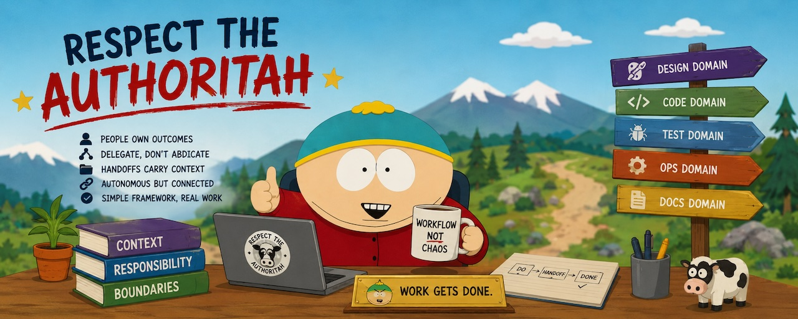

# Authoritah

A simple, elegant workflow for day-to-day agentic engineering.

It is a generic way of working, without harness tooling.

Reason about that workflow naturally, in terms of the people, responsibilities, boundaries,
and handoffs already present.

With clear prompting, this surprisingly simple structure can yield cleaner, better-organized
agentic development processes.

Authoritah keeps related development context together in clearly named directories, called
domains. Each domain holds the instructions, working state, handoffs, and optional tools for
one part of the workflow, so coding agents load only what is relevant.

Read the [workflow model](skills/init-authoritah/references/WORKFLOW.md).

## Install

From GitHub:

```sh
git clone https://github.com/roelentless/authoritah.git ~/.local/share/authoritah
make -C ~/.local/share/authoritah install
```

For local Authoritah development, link the current checkout instead:

```sh
make install
```

Update a GitHub installation with `make -C ~/.local/share/authoritah update`. Local development
installations use the current checkout directly.

## Initialize a repository

Ask a coding agent:

```text
Use the init-authoritah skill to initialize _workflow in this repository.
```

## License

[Apache License 2.0](LICENSE)
